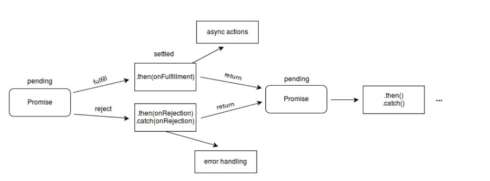

### promise

首先， `promise`是一个对象。代表了一个异步操作的完成和失败以及结果值。

它是一个函数返回的对象， 我看可以将回调函数绑定在它上面，就不需要一开始就将回调函数绑定作为参数传给这个函数了
```js
function successCallback(result) {
  console.log('success');
}
function failureCallback(result) {
  console.log('failule');
}

createAsync(msg, successCallback, failureCallback)


//用promise的写法
//createAsync返回的是一个promise对象
createAsync(msg).then(successCallback, failureCallback);
```
### 基本描述
一个`promise`一定处于下面的几种状态之一：
1. 待定（pending): 代表最初的状态， 没有被`resolve`, 也没有被`reject`
2. 兑现(resolved)： 操作成功
3. 拒绝(rejected)：操作失败

待定状态的 `Promise` 对象要么会通过一个值被兑现（`fulfilled`），要么会通过一个原因（错误）被拒绝（`rejected`）。当这些情况之一发生时，我们用 `promise` 的 `then` 方法排列起来的相关处理程序就会被调用。如果 `promise` 在一个相应的处理程序被绑定时就已经被兑现或被拒绝了，那么这个处理程序就会被调用，因此在完成异步操作和绑定处理方法之间不会存在竞争状态



```js
const myPromise =
  (new Promise(myExecutorFunc))
  .then(handleFulfilledA)
  .then(handleFulfilledB)
  .then(handleFulfilledC)
  .catch(handleRejectedAny);
```
过早的处理被拒绝的`promise`会对之后promise的链式调用有影响，但是有时候也不得不这样做
更好的办法是我们在最后一个`.catch`语句再进行处理。


### promise特点
`promise`有以下的一些特点：
- 在本轮事件循环运行完成之前， 回调函数是不会执行的
- 即使异步操作已经完成（成功或失败），在这之后通过 then() 添加的回调函数也会被调用，`then`返回的是不同于上一个的新`promise`,并会有上一步操作返回的结果
- 通过多次调用 then() 可以添加多个回调函数，它们会按照插入顺序进行执行
- promise可以链式调用
- 可以很好的解决回调地狱的问题


### Catch

在某些情况下，在回调执行失败之后还要继续使用链式操作，可以使用`Catch`在链式操作中抛出一个失败，然后继续执行新的操作。
一旦遇到错误，浏览器会顺着promise链寻找下一个回调失败函数或者由`catch`指定的失败回调函数。

```js
new Promise((resolve, reject) => {
    console.log('初始化'); // 初始化

    resolve();
})
.then(() => {
    throw new Error('有哪里不对了'); //因为抛出错误，以后的代码不会执行

    console.log('执行「这个」”');
})
.catch(() => {
    console.log('执行「那个」'); // 执行「那个」
})
.then(() => {
    console.log('执行「这个」，无论前面发生了什么'); //执行「这个」，无论前面发生了什么
});

```

### 构造函数

`Promise()构造器` 主要用于包装不支持promise的函数

```js
const myPromise = new Promise((resolve, reject) => {
  setTimeout(() => {
    resolve('lqy')
  }, 2000)
})
myPromise.then((name) => {
  console.log(name);
})
console.log(myPromise);
//Promise { <pending> }
// lqy
```
通过new关键字和Promise构造器创建它的对象。这个构造器接受一个名为"executor function"的函数。这个函数应当接受两个函数参数。当异步任务成功时，第一个函数（resolve）将被调用，并返回一个值代表成功。当其失败时，第二个函数（reject）将被调用，并返回失败原因（失败原因通常是一个error对象）


### Promise.all()
```js
Promise.all(iterable)：
参数：为一个可迭代对象。
返回值： 
- 当传入的是一个空的迭代对象， 则返回一个resolved状态的promise
const promise1 = Promise.all([])
console.log(promise1); //Promise {<fulfilled>: Array(0)}

- 若参数不包含任何promise,则返回一个异步完成的的promise

- 其他情况下返回一个preding状态的promise


(Array，Map，Set都属于ES6的iterable类型）且只返回一个promise实例，这个是输入的所有promise的resolve回调的结果是一个数组。
-----------------------------------------------------------------------------------


const promise1 = Promise.resolve(3)
const promise2 = 12
const promise3 = new Promise((resolve, reject) => {
  setTimeout(resolve, 2000, 'lqy')
  // setTimeout(reject, 2000, 'lqy') //这个地方就会出现错误
})

Promise.all([promise1, promise2, promise3]).then((values) => {
  console.log(values); //[ 3, 12, 'lqy' ]
})

```
*这个Promise的resolve回调执行是在所有输入的promise的resolve回调都结束，或者输入的iterable里没有promise了的时候。*
*它的reject回调执行是，只要任何一个输入的promise的reject回调执行或者输入不合法的promise就会立即抛出错误不管其他promise有没有完成，并且reject的是第一个抛出的错误信息。*

#### Promise.all 当且仅当传入的可迭代对象为空时为同步

只有迭代对象为空时是同步， 其他情况都是异步。

#### Promise.all 的快速返回失败行为
Promise.all 在任意一个传入的 promise 失败时返回失败。例如，如果你传入的 promise中，有四个 promise 在一定的时间之后调用成功函数，有一个立即调用失败函数，那么 Promise.all 将立即变为失败。


### Promise.resolve()

