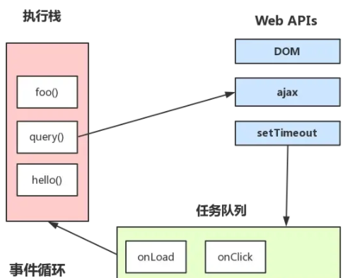

### Event Loop 是什么

`Event loop`就是事件循环，浏览器或 Node 的一种解决 javaScript 单线程运行时不会阻塞的一种机制，也就是我们经常使用异步的原理

### Event Loop 分类

在 javascript 中，任务被分为两类，一种叫宏任务(MacroTask)，另一种叫微任务(MicroTask)

- 宏任务(MacroTask)

  宏任务包括：`script全部代码、setTimeout、setInterval、setImmediate`（浏览器暂时不支持，只有 IE10 支持)、I/O、`UI Rendering`

- 微任务(MicroTask)

  `Process.nextTick(Node独有)、Promise、MutationObserve`

### 浏览器中的 Event Loop

Javascript 有一个 main thread 主线程和 call-stack 调用栈(执行栈)，所有的任务都会被放到调用栈等待主线程执行。

---

#### JS 调用栈

JS 调用栈采用的是后进先出的规则，当函数执行的时候，会被添加到栈的顶部，当执行栈执行完之后，就会从栈中移除，直到栈被清空。

#### 同步任务和异步任务

javascript 单线程任务被分为同步任务和异步任务。

同步任务会在调用栈中按照顺序等待主线程依次执行，异步任务会在异步任务有了结果后，将注册的回调函数放入任务队列中等待主线程空闲的时候（调用栈被清空），被读取到栈内等待主线程的执行 

### 事件循环的进程模型

- 选择当前要执行的任务队列， 选择任务队列中最先进入的任务，如果仍无队列为空，则跳转到微任务的执行步骤(队列是一个先进先出的数据结构)
- 将事件循环中的任务设置为已选择任务
- 执行任务
- 将事件循环中当前运行任务设置为 Null,6
- 将已经运行完成的任务从任务队列中删除
- 微任务步骤： 进入微任务检查点
- 更新界面渲染
- 返回第一步

```js
skjisojdois
```
