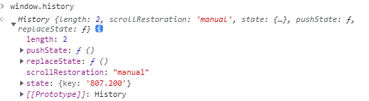

### 两种前端路由的原理与区别

### 1. History对象
history是BOM的一个一个对象，通过`window.istory`老获取当前窗口的浏览记录

在一个浏览器窗口中，所有访问过的也买你地址都会保存到`history`对象中。


为了安全考虑，无法通过JS读取浏览过的具体地址。但是可以在不同的地址之间导航

  + 1.1 属性
    + length属性： 当前窗口访问过的网址数量，当前的也买你也是计算在内的
    + state: history堆栈顶部的状态值。通常为undefined,表示未设置。

  + `history.back()`: 回退到上一个网页
  + `history.forward()`: 前进到下一个网页
  + `history.go(num)`： 移动到基于当前位置的网址页面 ,正数为前进，负数是后退。不带参数或者参数为0是刷新页面
  + `history.pushState()`:在浏览历史中添加一条记录，但是在添加完地址之后页面不会跳转，只是作为浏览历史的一个记录。
    ```js
    window.history.pushState(state, title, url)

    - state: 一个与添加的记录相关联的状态对象，会在 popstate 事件中传入回调函数。它是一个单独的对象，可以在重新载入该页面时进行使用。如果不需要，设置为 null 即可
    - title: 新页面的标题
    - url: 新的网址，但是这个网址不能是跨域的地址
    ```
  + `history.replaceState(state, title,  url)`: 修改当前的记录,只会修改现在在栈顶的地址


  + `popState事件`： 浏览历史发生变化，并且页面没有加载时，才会触发popState事件，并且页面刷新和第一次加载的时候都不会出发popstate事件。如上提到的要在浏览历史发生变化且也买你没有加载的时候才出发事件。也就是说在调用`history.pushState`和`history.replaceState`之后才会触发popState事件。

  + `hashchange事件`：hash是指url中#后面的内容(#)，【hashchange 事件就是对url中hash值改变进行监听的事件。】,`hashchange 的事件对象包含hash改变前后的URL：oldURL 和 newURL 属性。`
  + `popstate`和`hashchange`事件发生的顺序： `popstate`先触发然后触发`hashchange`事件


### 2. Location对象
Location 也是浏览器提供的原生对象，可以获取当前页面的URL信息以及进行操作。可以通过window.location或document.location属性获取该对象

```js
//当前网址： https://developer.mozilla.org/zh-CN/docs/Web/API/Location#?name=1
  document.location.href: 返回完整的URL
  //'https://developer.mozilla.org/zh-CN/docs/Web/API/Location'
  document.location.protocol: 当前URL的协议
  //'https:'
  document.location.host: 主机
  //'developer.mozilla.org'
  document.location.hostname: 主机名
  //'developer.mozilla.org'
  document.location.search: 查询字符串部分，从问号?开始
  //'?name=1'
  document.location.hash: 片段字符串那部分
  //'#?name=1'
  document.location.origin: URL 的协议、主机名和端口 *只读*
  //'https://developer.mozilla.org'
```
  #### 2.1 方法
    - location.assign(url): 用于跳转到指定的url，url参数必须有效。
    + location.replace(url): 跳转到指定的url，并在history中删除当前网址。也就是说，使用这个方法之后就无法回到当前页面了。在history中由新的地址替换了旧地址。
    - location.reload()： 用于重新加载浏览器当前页面相当于刷新。reload 接受一个布尔值参数，如果参数为true，浏览器将向服务器重新请求这个网页，重新加载后页面将滚  动到顶部(即 scrollTop === 0)。 如果参数为 false 或为空，浏览器将从本地缓存重新加载该网页，并且重加载后的网页视口，还是之前的位置
  #### 2.2 刷新当前页面的方法
   - location.reload():
   - history.go():不传参数或参数为0都可刷新当前页面
   - document.location.assign(window.location.href)


 