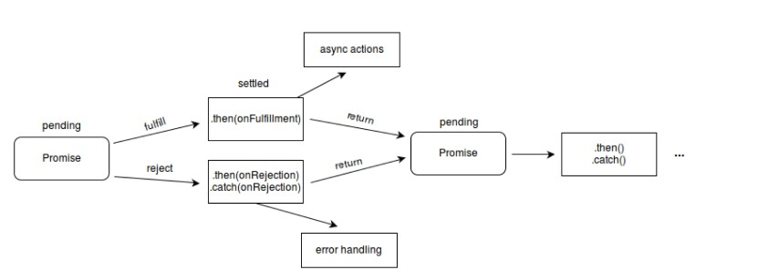

### promise

首先， `promise`是一个对象。代表了一个异步操作的完成和失败以及结果值。

它是一个函数返回的对象， 我看可以将回调函数绑定在它上面，就不需要一开始就将回调函数绑定作为参数传给这个函数了
```js
function successCallback(result) {
  console.log('success');
}
function failureCallback(result) {
  console.log('failule');
}

createAsync(msg, successCallback, failureCallback)


//用promise的写法
//createAsync返回的是一个promise对象
createAsync(msg).then(successCallback, failureCallback);
```
### 基本描述
一个`promise`一定处于下面的几种状态之一：
1. 待定（pending): 代表最初的状态， 没有被`resolve`, 也没有被`reject`
2. 兑现(resolved)： 操作成功
3. 拒绝(rejected)：操作失败

待定状态的 `Promise` 对象要么会通过一个值被兑现（`fulfilled`），要么会通过一个原因（错误）被拒绝（`rejected`）。当这些情况之一发生时，我们用 `promise` 的 `then` 方法排列起来的相关处理程序就会被调用。如果 `promise` 在一个相应的处理程序被绑定时就已经被兑现或被拒绝了，那么这个处理程序就会被调用，因此在完成异步操作和绑定处理方法之间不会存在竞争状态



```js
const myPromise =
  (new Promise(myExecutorFunc))
  .then(handleFulfilledA)
  .then(handleFulfilledB)
  .then(handleFulfilledC)
  .catch(handleRejectedAny);
```
过早的处理被拒绝的`promise`会对之后promise的链式调用有影响，但是有时候也不得不这样做
更好的办法是我们在最后一个`.catch`语句再进行处理。


### promise特点
`promise`有以下的一些特点：
- 在本轮事件循环运行完成之前， 回调函数是不会执行的
- 即使异步操作已经完成（成功或失败），在这之后通过 then() 添加的回调函数也会被调用，`then`返回的是不同于上一个的新`promise`,并会有上一步操作返回的结果
- 通过多次调用 then() 可以添加多个回调函数，它们会按照插入顺序进行执行
- promise可以链式调用
- 可以很好的解决回调地狱的问题


### Catch

在某些情况下，在回调执行失败之后还要继续使用链式操作，可以使用`Catch`在链式操作中抛出一个失败，然后继续执行新的操作。
一旦遇到错误，浏览器会顺着promise链寻找下一个回调失败函数或者由`catch`指定的失败回调函数。

```js
new Promise((resolve, reject) => {
    console.log('初始化'); // 初始化

    resolve();
})
.then(() => {
    throw new Error('有哪里不对了'); //因为抛出错误，以后的代码不会执行

    console.log('执行「这个」”');
})
.catch(() => {
    console.log('执行「那个」'); // 执行「那个」
})
.then(() => {
    console.log('执行「这个」，无论前面发生了什么'); //执行「这个」，无论前面发生了什么
});

```

### 构造函数

`Promise()构造器` 主要用于包装不支持promise的函数

```js
const myPromise = new Promise((resolve, reject) => {
  setTimeout(() => {
    resolve('lqy')
  }, 2000)
})
myPromise.then((name) => {
  console.log(name);
})
console.log(myPromise);
//Promise { <pending> }
// lqy
```
通过new关键字和Promise构造器创建它的对象。这个构造器接受一个名为"executor function"的函数。这个函数应当接受两个函数参数。当异步任务成功时，第一个函数（resolve）将被调用，并返回一个值代表成功。当其失败时，第二个函数（reject）将被调用，并返回失败原因（失败原因通常是一个error对象）


### Promise.all()
```js
Promise.all(iterable)：
参数：为一个可迭代对象。
返回值： 
- 当传入的是一个空的迭代对象， 则返回一个resolved状态的promise
const promise1 = Promise.all([])
console.log(promise1); //Promise {<fulfilled>: Array(0)}

- 若参数不包含任何promise,则返回一个异步完成的的promise

- 其他情况下返回一个preding状态的promise


(Array，Map，Set都属于ES6的iterable类型）且只返回一个promise实例，这个是输入的所有promise的resolve回调的结果是一个数组。
-----------------------------------------------------------------------------------


const promise1 = Promise.resolve(3)
const promise2 = 12
const promise3 = new Promise((resolve, reject) => {
  setTimeout(resolve, 2000, 'lqy')
  // setTimeout(reject, 2000, 'lqy') //这个地方就会出现错误
})

Promise.all([promise1, promise2, promise3]).then((values) => {
  console.log(values); //[ 3, 12, 'lqy' ]
})

```
*这个Promise的resolve回调执行是在所有输入的promise的resolve回调都结束，或者输入的iterable里没有promise了的时候。*
*它的reject回调执行是，只要任何一个输入的promise的reject回调执行或者输入不合法的promise就会立即抛出错误不管其他promise有没有完成，并且reject的是第一个抛出的错误信息。*

#### Promise.all 当且仅当传入的可迭代对象为空时为同步

只有迭代对象为空时是同步， 其他情况都是异步。

#### Promise.all 的快速返回失败行为
Promise.all 在任意一个传入的 promise 失败时返回失败。例如，如果你传入的 promise中，有四个 promise 在一定的时间之后调用成功函数，有一个立即调用失败函数，那么 Promise.all 将立即变为失败。


### Promise.any()
Promise.any接受的也是一个可迭代对象，只要其中的一个promise成功，就返回这个成功的promise.
如果没有一个promise成功，就返回一个失败的promise和AggrefateError类型的实例，它是Error的一个子类。
从本质上来说，promise.any和promise.all是相反的。

参数： 一个可迭代的对象
返回值： 
- 如果传入的参数是一个空的迭代对象，就返回一个已经失败的promise
- 如果传入的参数不包含任何promise,就返回一个异步完成的promise
- 其他情况下都会返回一个pending的promise.只要传入的迭代对象中的任何一个promise变成成功或失败状态，那么promise就会相应异步的编程成或者失败的状态

promise.any()主要是用于返回一个成功状态的promise.只要有一个promis成功这个方法就会终止。不会等待其他的promise完成

与Promise.all()不同的是它不会返回一组完成值。只会得到一个成功值。


### Promise.race()
Promise.race(iterable) 方法返回一个 promise，一旦迭代器中的某个promise解决或拒绝，返回的 promise就会解决或拒绝
参数： 可迭代对象
返回值： 一个待定的 Promise 只要给定的迭代中的一个promise解决或拒绝，就采用第一个promise的值作为它的值，从而异步地解析或拒绝（一旦堆栈为空）

此方法也接受一个包含需
监视的 Promise 的可迭代对象，并返回一个新的 Promise ，但一旦来源 Promise 中有一个被解决，所返回的 Promise 就会立刻被解决。与等待所有 Promise 完成的 Promise.all() 方法不同，在来源 Promise 中任意一个被完成时， Promise.race() 方法所返回的 Promise 就能作出响应

### Promise.resolve()

语法：
Promise.resolve(value): value是将要被Promise解析的对象，可以是一个值，对象或者为可迭代对象
返回值： 带有一个解析值得promise对象。若参数本来就是promise对象，就直接返回这个对象。


promise.resolve()方法返回一个以给定值解析后的promise对象，
若这个值是一个promise,则返回这个promise;
若这个值带有then方法，返回的promise会“跟随”这个带有then方法的对象，采用它的最终状态
否则，返回的promise将以这个值完成

```js
const promise1 = Promise.resolve(22)
const promise2 = Promise.resolve(promise1) //参数是一个promise对象，则直接返回这个对象
promise2.then((value) => {
  console.log(value); // 22
})
console.log(promise1 === promise2); //true
//log
// true
// 22

```


### Promise.reject()

`Promise.reject()`返回的是一个带有拒绝原因的promise对象

```js
Promise.reject(22).then((value) => {
  console.log(value); //Promise {<rejected>: 22}
})
```

### Promise.prototype.then()

`Promise.prototype.then()`返回一个promise， 最多需要两个参数: 成功 和 失败的回调函数

*可以链式调用*

参数：
- onFulfilled()
  成功时候的回调，要有一个参数接受最终的结果。若这个参数不是函数，在内部会被转化为（value）=> value, 鸳鸯返回promise的结果
- onRejected() 
  失败时候逇回调， 有一个参数， 是失败的原因， 若这个参数不是函数，在内部替换为throw抛出错误

返回值：
- 返回了一个值，那么 then 返回的 Promise 将会成为接受状态，并且将返回的值作为接受状态的回调函数的参数值。
- 没有返回任何值，那么 then 返回的 Promise 将会成为接受状态，并且该接受状态的回调函数的参数值为 undefined。
- 抛出一个错误，那么 then 返回的 Promise 将会成为拒绝状态，并且将抛出的错误作为拒绝状态的回调函数的参数值。
- 返回一个已经是接受状态的 Promise，那么 then 返回的 Promise 也会成为接受状态，并且将那个 Promise 的接受状态的回调函数的参数值作为该被返回的Promise的接受状态回调函数的参数值。
- 返回一个已经是拒绝状态的 Promise，那么 then 返回的 Promise 也会成为拒绝状态，并且将那个 Promise 的拒绝状态的回调函数的参数值作为该被返回的Promise的拒绝状态回调函数的参数值。
- 返回一个未定状态（pending）的 Promise，那么 then 返回 Promise 的状态也是未定的，并且它的终态与那个 Promise 的终态相同；同时，它变为终态时调用的回调函数参数与那个 Promise 变为终态时的回调函数的参数是相同的

```js
new Promise((resolve, reject) => {
  // resolve('success!!!')
  reject(new Error('failure了'))
}).then((value) => {
  console.log(value); //success
}).catch((value) => {
  console.log(value); //Error: failure了
})

var p2 = new Promise(function (resolve, reject) {
  resolve(1);
});

p2.then(function (value) {
  console.log(value); // 1 先输出
  return value + 1;
}).then(function (value) {
  console.log(value + ' - A synchronous value works'); //2 -- A synchronous value works //最后输出
});

p2.then(function (value) {
  console.log(value); // 1 第二输出
});
```


### promise.prototype.catch()
`catch()`方法返回一个promise，并且用于处理失败的情况。
参数： 接受一个函数，这个函数有一个参数，用于表明reject的原因。
当Promise被reject之后会调用这个函数，并返回reject的原因。

在异步函数中抛出的错误不会被catch捕获， 且在resolve后面抛出错误也不会捕获

如果是一个已经resolved的promise，将永远不会调用catch()方法。


### Promise.prototype.finally()
finally()方法返回一个promise, 在promise结束的时候，无论结果是成功还是失败，都会执行指定的函数。
避免了需要在then()和catch()中写相同的代码。

参数: Promise结束之后调用的函数。
返回值： 设置了finally回调函数的promise对象。


- 由于不知道Promise的结果，所以finally中的回调函数不带参数，只用于无论最终结果如何都要执行的情况。
- 与Promise.resolve(2).then(() => {}, () => {}) （resolved的结果为undefined）不同，Promise.resolve(2).finally(() => {}) resolved的结果为 2。
- 同样，Promise.reject(3).then(() => {}, () => {}) (fulfilled的结果为undefined), Promise.reject(3).finally(() => {}) rejected 的结果为 3。
- 在finally回调中 throw（或返回被拒绝的promise）将以 throw() 指定的原因拒绝新的promise


### Async

将 async 关键字加到函数申明中，可以告诉它们返回的是 promise，而不是直接返回值。此外，它避免了同步函数为支持使用 await 带来的任何潜在开销。在函数声明为 async 时，JavaScript引擎会添加必要的处理，以优化你的程序

```js
async function hello() { return "Hello" };
hello();

let hello = async function() { return "Hello" };
hello();

let hello = async () => { return "Hello" };

hello().then((value) => console.log(value))


以上代码的效果都是一样的。


```


### Await

当 await 关键字与异步函数一起使用时，它的真正优势就变得明显了 —— 事实上， await 只在异步函数里面才起作用。它可以放在任何异步的，基于 promise 的函数之前。它会暂停代码在该行上，直到 promise 完成，然后返回结果值。在暂停的同时，其他正在等待执行的代码就有机会执行了