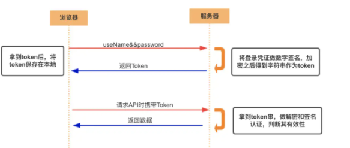
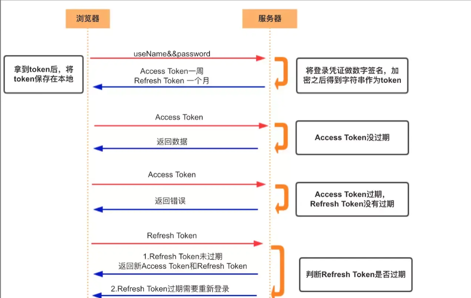
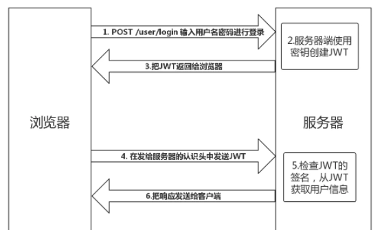

### Cookie、Session、Token、JWT

### 1. Authentication 授权
- `用户授予第三方应用访问该用户某些资源的权限`
- 实现授权的方式： cookie session token OAuth

### 2. Credentials  凭证


### 3. Cookie

+ http是无状态的协议，对于事物处理没有记忆能力，每次客户端和服务端交互之后，服务端不会保存任何信息；
  也就是说，每个请求都是完全独立的，服务器是无法确认当前的请求和上一次的请求是不是同一个人。服务器与浏览器为了进行会话追踪。就必须主动去维护一个状态。 
  为了知道当前的请求和上一次的请求是不是来自同一个请求端。这个状态就需要session或者cookie来维护，cookie大小不超过4kb的
  
+ cookie是存储在客户端的。在下一次请求同一服务器的时候会被携带着一起上传到服务器。

+ cookie是不可跨域的， 每个 cookie 都会绑定单一的域名，无法在别的域名下获取使用，一级域名和二级域名之间是允许共享使用的（靠的是 domain）.


cookie只要用于以下三个方面： 
  1. 会话状态管理
  2. 个性化设置
  3. 浏览器行为跟踪

#### 3.1 创建Cookie

当服务器收到http请求时，会在响应头里面添加一个`Set-Cookie`选项，浏览器收到响应之后就会保存cookie.在这之后对这个服务器每次请求都会将Cookie发送给服务器。

```js
//键值对
Set-Cookie: <键> = <值>
```

#### 3.2 定义Cookie的生命周期
定义Cookie的两种方式：
  + 会话期Cookie: 这是最简单的的Cookie，在会话结束之后浏览器就会自动删除。会话期`Cookie`不需要指定过期时间`（Expires）`或者有效期`（Max-Age）`
  + 持久性Cookie的生命周期取决于过期时间`(Expires)`或者 `(Max-Age)`
  + 过期时间设置后只与客户端有关，而不是服务端

#### 3.3 限制访问Cookie

两种限制访问Cookie的方法：
  + Secure: 标记为 Secure 的 Cookie 只应通过被 HTTPS 协议加密过的请求发送给服务端，因此可以预防 man-in-the-middle 攻击者的攻击
  + HttpOnly: 此类 Cookie 仅作用于服务器


#### 3.4 Cookie的作用域

- `Domain`属性
Domain 指定了哪些主机可以接受 Cookie。如果不指定，默认为 origin，不包含子域名。如果指定了Domain，则一般包含子域名。因此，指定 Domain 比省略它的限制要少。但是，当子域需要共享有关用户的信息时，这可能会有所帮助

- `Path`属性
Path 标识指定了主机下的哪些路径可以接受 Cookie（该 URL 路径必须存在于请求 URL 中）。以字符 %x2F ("/") 作为路径分隔符，子路径也会被匹配


- Cookie重要属性<br>
  - `-name=value`: 键值对，设置 Cookie 的名称及相对应的值，都必须是字符串类型- 如果值为 Unicode 字符，需要为字符编码。- 如果值为二进制数据，则需要使用 BASE64 编码。<br>
  - `domain`: 指定 cookie 所属域名，默认是当前域名<br>
  - `path`: 指定 cookie 在哪个路径（路由）下生效，默认是 '/'。如果设置为 /abc，则只有 /abc 下的路由可以访问到该 cookie，如：/abc/read。<br>
  - `maxAge`: cookie失效的时间，单位秒。如果为整数，则该 cookie 在 maxAge 秒后失效。如果为负数，该 cookie 为临时 cookie ，关闭浏览器即失效，浏览器也不会以任何形式保存该 cookie 。如果为 0，表示删除该 cookie 。默认为 -1。- 比 expires 好用。<br>
  - `expires`: 过期时间，在设置的某个时间点后该 cookie 就会失效。一般浏览器的 cookie 都是默认储存的，当关闭浏览器结束这个会话的时候，这个 cookie 也就会被删除<br>
  - `secure`: 该 cookie 是否仅被使用安全协议传输。安全协议有 HTTPS，SSL等，在网络上传输数据之前先将数据加密。默认为false。当 secure 值为 true 时，cookie 在 HTTP 中是无效，在 HTTPS 中才有效。<br>
  - `httpOnly`:  如果给某个 cookie 设置了 httpOnly 属性，则无法通过 JS 脚本 读取到该 cookie 的信息，但还是能通过 Application 中手动修改 cookie，所以只是在一定程度上可以防止 XSS 攻击，不是绝对的安全<br>

### 4. Session

`Session`是另一种记录服务端和客户端会话状态的机制
`Session`是基于`Cookie`实现的，`Session`是存储在服务端的。`SeesionID`会被存储到客户端的`Cookie`中

  

#### 4. 1 session认证流程
  1. 用户第一次请求的时候，服务器根据用户提交的信息创建对应的Session
  2. 当会话结束的时候将这个Session的唯一标识SeeionID返回给浏览器
  3. 浏览器收到服务器返回的SeesionID后，会将SessionID添加到Cookie中。同时会记录这个sessionID对应的域
  4. 当用户第二次访问这个服务器的时候，请求会自动判断这个域名下是否有Cookie信息。若是有的话会将cookie也发送给服务器。服务端会从Cookie中获取sessionID，再根据sessionid查找对应的session。若是没有找到则说明用户登陆失败。

### 5. Seesion和Cookie的区别
  - 安全性。 `Session`比`Cookie`更加安全。`Session`是存储在服务端的，而`cookie`是存储在本地的
  - 存取值类型不同： `Cookie` 只支持存字符串数据，想要设置其他类型的数据，需要将其转换成字符串，`Session` 可以存任意数据类型。
  - 有效期不同： `Cookie`可以设置长时间的有效期而`session`则一般比较短
  - 存储大小不同： `Cookie`的数据不能超过4Kb， `Session`可以存储的数据远高于`Cookie`,但是随着访问过多会占用过多的服务器资源。

### 6. Token(令牌)

1. `Access Token`(访问令牌)
      - 访问资源接口时所需要的资源凭证
      - 简单token的组成： uid(用户唯一的身份标识)、time(当前时间的时间戳)、sign（签名，token 的前几位以哈希算法压缩成的一定长度的十六进制字符串）
      - 特点： 
          1. 服务端无状态化，可扩展性好
          2. 支持移动端设备
          3. 安全
          4. 支持跨程序调用
2.  `Token`身份验证流程

  

  1. 客户端使用用户名跟密码请求登录
  2. 服务端收到请求，去验证用户名与密码
  3. 验证成功后，服务端会签发一个 token 并把这个 token 发送给客户端
  4. 客户端收到 token 以后，会把它存储起来，比如放在 cookie 里或者 localStorage 里
  5. 客户端每次向服务端请求资源的时候需要带着服务端签发的 token
  6. 服务端收到请求，然后去验证客户端请求里面带着的 token ，如果验证成功，就向客户端返回请求的数据

注意： 
  - 每一次请求都需要携带token,需要把token放到HTTP的Header里
  - 基于 token 的用户认证是一种服务端无状态的认证方式，服务端不用存放 token 数据。用解析 token 的计算时间换取 session 的存储空间，从而减轻服务器的压力，减少频繁的查询数据库
  - token 完全由应用管理，所以它可以避开同源策略
3. `Refresh Token`
  专用于刷新access token的token, 客户端直接用 refresh token 去更新 access token，无需用户进行额外的操作
  
  - Access Token的有效期比较短， 当Access Token由于过期失效时， 使用refresh token就可以重新获取新的Token,但是若refresh token也失效，就需要用户的额外操作。
  - Refresh Token是存储服务器中的，只有在申请新的AccessToken时才会验证，
          
### 7. JWT
JWT是JSON WEB Token的简称， 是目前最流行的跨域认证解决方案
WT 是为了在网络应用环境间传递声明而执行的一种基于 JSON 的开放标准（RFC 7519）。JWT 的声明一般被用来在身份提供者和服务提供者间传递被认证的用户身份信息，以便于从资源服务器获取资源。比如用在用户登录上

#### 7.1 JWT原理

`JWT`的数据结构:JWT包括三部分： Header(头部) Payload(负载) Signature(签名) 其中Payload是用来存放实际要传递的数据。将这三部分拼成一个字符串，用`.`分隔。就可以返回给用户。
JWT是默认不加密的。



1. JWT的认证流程
  + 用户输入用户密码之后，服务端认证成功，就会返回一个加密的Token,返回给客户端
  + 客户端保存这个token，可以自己选择保存的方式
  + 当用户希望访问一个受保护的资源时，需要请求头的 Authorization 字段中使用Bearer 模式添加 JWT  eg.`Authorization: Bearer <token>`
  + 服务端会检查请求头的JWT信息，若是合法，就允许用户的动作
  + 
2. JWT的使用方式：
  - 当用户希望访问一个受保护的资源时，可以把它放在Cookie中里面自动发送，但是这样不能跨域。所以更好的方法是放在http请求头的`Authorization`字段里，使用`Bearer`模式添加 <token>
  - 跨域的时候，可以把JWT放在Post请求的请求体中
  - 通过URL传输。

3. 特点
  - JWT默认是不加密的

  
测试


