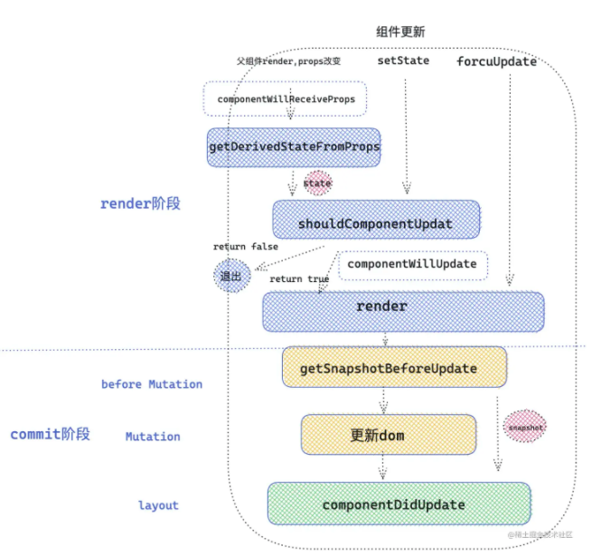

### LifeCycle

React 类组件为开发者提供了一些生命周期钩子函数，能让开发者在 React 执行的重要阶段，在钩子函数里做一些该做的事.

在 React16.18 之后，函数组件也可以通过使用 React Hooks,弥补函数组件没有生命周期的缺陷

###  类组件生命周期

React 的两个重要的阶段，render 阶段和 commit 阶段，React 在调和( render )阶段会深度遍历 React fiber 树，目的就是发现不同( diff )，
不同的地方就是接下来需要更新的地方，对于变化的组件，就会执行 render 函数。在一次调和过程完毕之后，就到了 commit 阶段，commit 阶段会创建修改真实的 DOM 节点

在 React 底层，类组件会被转换为 `fiber tag = 1`

_React 的大部分生命周期的执行，都在 mountClassInstance 和 updateClassInstance 这两个方法中执行_


- 初始化阶段
  1. constructor执行： 用来实例化组件的函数是	constructorClassInstance,
  2. 组件实例化之后经过mountClassInstance初始化
```js
//初始化组件实例
function mountClassInstance(workInProgress,ctor,newProps,renderExpirationTime){
    const instance = workInProgress.stateNode;//instance为组件实例
     const getDerivedStateFromProps = ctor.getDerivedStateFromProps;
  if (typeof getDerivedStateFromProps === 'function') { /* ctor 就是我们写的类组件，获取类组件的静态防范 */
     const partialState = getDerivedStateFromProps(nextProps, prevState); /* 这个时候执行 getDerivedStateFromProps 生命周期 ，得到将合并的state */
     const memoizedState = partialState === null || partialState === undefined ? prevState : Object.assign({}, prevState, partialState); // 合并state
     workInProgress.memoizedState = memoizedState;
     instance.state = workInProgress.memoizedState; /* 将state 赋值给我们实例上，instance.state  就是我们在组件中 this.state获取的state*/
  }
  if(typeof ctor.getDerivedStateFromProps !== 'function' &&   typeof instance.getSnapshotBeforeUpdate !== 'function' && typeof instance.componentWillMount === 'function' ){
      instance.componentWillMount(); /* 当 getDerivedStateFromProps 和 getSnapshotBeforeUpdate 不存在的时候 ，执行 componentWillMount*/
  }
}
```
 3. getDerviedStateFromProps执行
	在初始化阶段，getDerviedStateFromProps是要执行的第二个生命周期，它是从ctor上绑定的静态方法
```js
const getDerivedStateFromProps = ctor.getDerivedStateFromProps;
const partialState = getDerivedStateFromProps(nextProps, prevState); /* 这个时候执行 getDerivedStateFromProps 生命周期 ，得到将合并的state */
const memoizedState = partialState === null || partialState === undefined ? prevState : Object.assign({}, prevState, partialState);
```
	传入 props ，state 。 返回值将和之前的 state 合并，作为新的 state ，传递给组件实例使用
  4. render函数
  5. componentDidMount执行
*执行顺序：constructor -> getDerivedStateFromProps / componentWillMount -> render -> componentDidMount*

- 更新阶段
	根据updateClassComponent函数，若发现current不为null时，说明类组件已经被挂载过，则执行更新逻辑。
  
 - 销毁阶段
销毁阶段就比较简单了，在一次调和更新中，如果发现元素被移除，就会打对应的 Deletion 标签 ，
然后在 commit 阶段就会调用 componentWillUnmount 生命周期，接下来统一卸载组件以及 DOM 元素。
	
#### React各生命周期阶段都会做什么？
1. Constructor
constructor 在类组件创建实例时调用，而且初始化的时候执行一次，所以可以在 constructor 做一些初始化的工作
- 初始化state,
- 对类组件做一些处理，比如防抖，绑定this， 节流等
- 对类组件进行一些必要生命周期的劫持，渲染劫持
2. getDerivedStateFromProps(nextProps, prevState)
	- nextProps: 父组件型新传递的props，
	- prevState: 在此次跟新之前的state

getDerivedStateFromProps作为类的一个静态方法执行，内部访问不到this,也就无法访问实例。更趋向于纯函数。用来替代`componentWillMount`和`componentWillReceiveProps`。

主要用于在初始化和数据更新时接受父组件的props数据，对props进行格式化。返回值作为state的更新依据。

每次渲染之前都会调用，不管是props改变还是state改变或者时`forceUpdate`与`componentWillReceiveProps`不同，后者只会在父组件重新渲染时触发。

主要作用：
	- 替代`componentWillMount`和`componentWillReceiveProps`
	- 组件初始化或者更新时，	将接收到的props返回作为state
	- 返回值与state合并。可以作为shouleComponentUpdate的第二个参数。可以判断是否渲染组件
3. render
Jsx的各个元素被React.createElement创建成react element对象的形式。一次render的过程就是一尺react element对象的创建过程。
可以在render里面可以用React.createElement创建元素，React.cloneElementle克隆元素，React.children遍历children的操作。
4. getSnapshotBeforeUpDate
> getSnapshotBeforeUpDate(preState, preProps)
> preState: 更新前的state
> preProps: 更新前的props
返回一个值作为一个快照，传递给componentDidUpdate的第三个参数

*getSnapshotBeforeUpdate 这个生命周期意义就是配合componentDidUpdate 一起使用，计算形成一个 snapShot 传递给 componentDidUpdate 。保存一次更新前的信息*

5. componentDidUpdate
> componentDidUpdate(preProps, preState, snapShot)
> preProps: 更新前的props
> preState: 更新前的state
> snapShot为getSnapshotBeforeUpdate返回的一个快照，用于保留更新之前的DOM信息。

6. componentDidMount
componentDidMount和componentDidUpdate的执行时机时一样的。前者用于初始化，后者是组件更新。
- 这个时候DOM已经创建完毕，可以做一些基于DOM的操作，作为DOM事件监听器
- 向服务器请求数据。


7. shouldComponentUpdate
> shouldComponentUpdate(newProps.newState, nextContent{})
一般用于组件优化，它的返回值决定是否重新渲染类组件。需要重点关注的是第二个参数 newState ，如果有 getDerivedStateFromProps 生命周期 ，它的返回值将合并到 newState ，供 shouldComponentUpdate 使用

8. componentWillUnmount
主要用于销毁组件，主要做一些收尾工作。如清除定时器，延时器。清楚事件监听

### 函数组件生命周期替代方案Hooks

Hooks弥补了函数组件没有生命周期的缺陷，主要用到了`useEffect`和`useLayoutEffect`

1. useEffect
```js
useEffect(() => {
	return destory
},[])
```
useEffect 第一个参数 callback, 返回的 destory ， destory 作为下一次callback执行之前调用，用于清除上一次 callback 产生的副作用。

第二个参数作为依赖项，是一个数组，可以有多个依赖项，依赖项改变，执行上一次callback 返回的 destory ，和执行新的 effect 第一个参数 callback 

对于 useEffect 执行， React 处理逻辑是采用异步调用 ，对于每一个 effect 的 callback， React 会向 setTimeout回调函数一样，放入任务队列，等到主线程任务完成，DOM 更新，js 执行完成，视图绘制完毕，才执行。所以 effect 回调函数不会阻塞浏览器绘制视图
2. useLayoutEffect
与useEffect不同的是，useLayoutEffect是采用的同步执行方式。
首先 useLayoutEffect 是在DOM 绘制之前，这样可以方便修改 DOM ，这样浏览器只会绘制一次，如果修改 DOM 布局放在 useEffect ，那 useEffect 执行是在浏览器绘制视图之后，接下来又改 DOM ，就可能会导致浏览器再次回流和重绘。而且由于两次绘制，视图上可能会造成闪现突兀的效果。
useLayoutEffect callback 中代码执行会阻塞浏览器绘制


