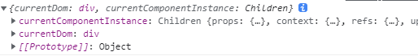
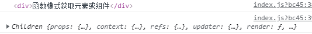
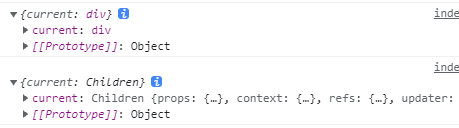

### Ref

#### ref对象创建
在react中有两种方式创建ref

1. 类组件中React.createRef
	Create.createRef的底层逻辑很简单
```js
export function createRef() {
	const refObject = {
		//返回一个对象，对象中有current属性，用来保存通过ref获的DOM元素，组件实例等。
		current: null,
	}
	return refObject;
}
```
可以将ref对象绑定在类组件实例上，这个可以方便后续操作ref
2. 函数组件中useRef
```js
export default function Index(){
    const currentDom = React.useRef(null)
    React.useEffect(()=>{
        console.log( currentDom.current ) // div
    },[])
    return  <div ref={ currentDom } >ref对象模式获取元素或组件</div>
}
```
useRef和createRef的底层是差不多的，但是有一点不一样。就是ref的存储位置是不相同的
在类组件中，有一个实例instance可以一直维护ref的信息，但是函数组件不同，函数组件每一次更新都是重新开始，所有的变量都需要重新声明。
这也是在函数组件中不能使用createRef的原因，会造成ref的内容丢失。

所以在函数组件中，hooks和函数组件对应的fiber建立了联系，将useRef产生的ref对象挂载到函数组件对应的fiber上，函数组件的每一次执行，只要函数组件不被销毁，对应的fiber一直存在，那么ref等信息就会一直保存下来。

#### 类组件获取Ref的三种方式
1. Ref属性是一个字符串
用一个字符串标记DOM元素，在底层`react`会将真实DOM绑定在`this.refs`上.
若是一个类组件，则会将组建的实例绑定在`this.refs`上。

2. Ref是一个函数
用一个函数标记ref时，会采用callback的方式，等到真实DOM创建完毕，以回调函数的方式返回。获取真实DOM和组件实例。

3. Ref是一个对象
获取到的是一个对象，用current属性。


#### Ref高阶使用
1. forwardRef转发Ref
forwardRef初衷是解决ref不能跨层级捕捉和传递的问题。orwardRef 接受了父级元素标记的 ref 信息，并把它转发下去，使得子组件可以通过 props 来接受到上一层级或者是更上层级的ref，
forwardRef 把 ref 变成了可以通过 props 传递和转发