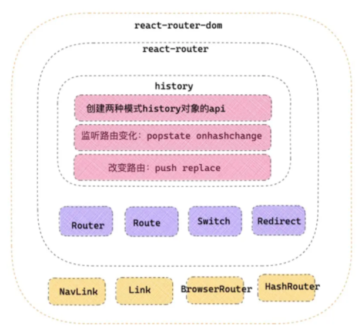
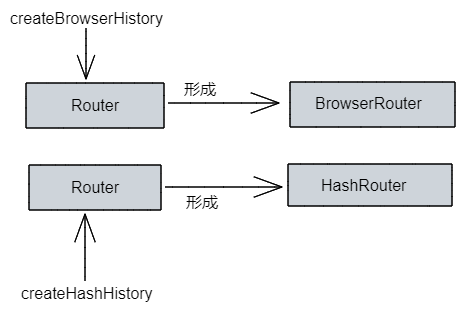

### React-router

### 路由原理

#### history ,React-router , React-router-dom 三者关系


#### 两种主要路由
- history模式： http://www.asjdi.cn/history
- hash模式： http://www.djisaji.cn/#/hash

1. 开启history模式
```js
import { BrowserRouter} from 'react-router-dom'
function Index(){
    return <BrowserRouter>
       { /* ...开启history模式 */ }
    </BrowserRouter>
}
```
2. 开启hash模式
```js
import { HashRouter} from 'react-router-dom'
function Index(){
    return <HashRouter>
       { /* ...开启history模式 */ }
    </HashRouter>
}
```

### React路由原理
1. BrowserHistory模式下
- 改变路由
> window.history.pushState
通常使用的是`history.push()`,本质上是调用`windows.history.pushState()`

```js
window.history.pushState(state, title, url)

- state: 一个与添加的记录相关联的状态对象，会在 popstate 事件中传入回调函数。它是一个单独的对象，可以在重新载入该页面时进行使用。如果不需要，设置为 null 即可
- title: 新页面的标题
- url: 新的网址，但是这个网址不能是跨域的地址
```
> history.replaceState
```js
`history.replaceState(state, title, url)`: 修改当前的记录,只会修改现在在栈顶的地址, `history.length`的长度不会变
```
- 监听路由popState
```js
window.addEventListener('popstate',function(e){
    /* 监听改变 */
})
```
同一个文档下的history对象发生变化时，就会触发popState,但是要注意，`window.pushState`和`window.replaceState`是不会触发`popState`的。
`popstate` 事件只会在浏览器某些行为下触发, 比如点击后退、前进按钮或者调用` history.back()`、`history.forward()`、`history.go()`方法。

2. HashHistory模式下
- 改变路由
> window.locatin.hash
通过 `window.location.hash` 属性获取和设置 `hash` 值。开发者在哈希路由模式下的应用中，切换路由，本质上是改变 `window.location.hash`
- 监听路由onHashChange
```js
window.addEventListener('hashchange',function(e){
    /* 监听改变 */
})
```

### React-router基本构成
#### history，location，match
- history 对象：history对象保存改变路由方法 push ，replace，和监听路由方法 listen 等。
- location 对象：可以理解为当前状态下的路由信息，包括 pathname ，state 等。
- match 对象：这个用来证明当前路由的匹配信息的对象。存放当前路由path 等信息。

#### 路由组件

#### Router
是整个应用路由的传递者和派发更新者。 可以看作是一个容器，应用在不同路由模式下向容器router中注入不同的history对象。



#### Route
Route 是整个路由核心部分，它的工作主要就是一个： 匹配路由，路由匹配，渲染组件。 由于整个路由状态是用 context 传递的，所以 Route 可以通过 RouterContext.Consumer 来获取上一级传递来的路由进行路由匹配，如果匹配，渲染子代路由。并利用 context 逐层传递的特点，将自己的路由信息，向子代路由传递下去。这样也就能轻松实现了嵌套路由
```js
//四种方式编写ROuter
function Index(){ 
    const mes = { name:'alien',say:'let us learn React!' }
    return <div>      
        <Meuns/>
        <Switch>
            <Route path='/router/component'   component={RouteComponent}   /> { /* Route Component形式 */ }
            <Route path='/router/render'  render={(props)=> <RouterRender { ...props }  /> }  {...mes}  /> { /* Render形式 */ }
            <Route path='/router/children'  > { /* chilren形式 */ }
                <RouterChildren  {...mes} />
            </Route>
            <Route path="/router/renderProps"  >
                { (props)=> <RouterRenderProps {...props} {...mes}  /> }  {/* renderProps形式 */}
            </Route>
        </Switch>
    </div>
}
export default Index
```
- Component 形式：将组件直接传递给 Route 的 component 属性，Route 可以将路由信息隐式注入到页面组件的 props 中，但是无法传递父组件中的信息，比如如上 mes 。
- render 形式：Route 组件的 render 属性，可以接受一个渲染函数，函数参数就是路由信息，可以传递给页面组件，还可以混入父组件信息。
- children 形式：直接作为 children 属性来渲染子组件，但是这样无法直接向子组件传递路由信息，但是可以混入父组件信息。
- renderProps 形式：可以将 childen 作为渲染函数执行，可以传递路由信息，也可以传递父组件信息。

#### exact
exact用于精确匹配，精确匹配原则。pathname 必须和 Route 的 path 完全匹配，才能展示该路由信息。

如果是嵌套路由的父路由，千万不要加 exact=true 属性。换句话只要当前路由下有嵌套子路由，就不要加 exact 。

在开发中可以使用`react-router-config`的`renderRoutes`完成

```js
const routes = [
	{name: '首页', path: '/',component: Home, exact: true, }
	{name: '列表页',path: '/router/list',  render:()=><List />},
]

function Index(){
	return (
		<div>
			{renderRoutes(routes)}
			<Main>
		</div>
	)
}
```

#### Switch 
Switch的作用是先通过匹配选出一个正确的Route进行渲染。不然所有的<Route>都会被挂载。但是挂载的路由展示还是不展示是需要通过内部的Location匹配

#### Redirect
Redirect 可以在路由不匹配情况下跳转指定某一路由，适合路由不匹配或权限路由的情况	
注意 Switch 包裹的 Redirect 要放在最下面，否则会被 Switch 优先渲染 Redirect ，导致路由页面无法展示

### 路由使用
#### 路由状态获取
1. 路由组件props
被 Route 包裹的路由组件 props 中会默认混入 history 等信息
2. withRouter
对于距离路由组件比较远的深层次组件，通常可以用 react-router 提供的 withRouter 高阶组件方式获取 histroy ，loaction 等信息
3. 对于函数组件
可以用 React-router 提供的自定义 hooks 中的 useHistory 获取 history 对象，用 useLocation 获取 location 对象
注意事项，无论是 withRouter ，还是 hooks ，都是从保存的上下文中获取的路由信息，所以要保证想要获取路由信息的页面，都在根部 Router 内部

#### 路由跳转
1. 路由跳转
- 函数式： history.push('/home')
- 声明式： <NavLink to='/home'/>  或者 <Link to='/home'/>

2. 参数传递
- url拼接：history.push(`/home?name=${name}&message=${msg}`)
- state路由状态
- 动态路径参数路由


	
	
