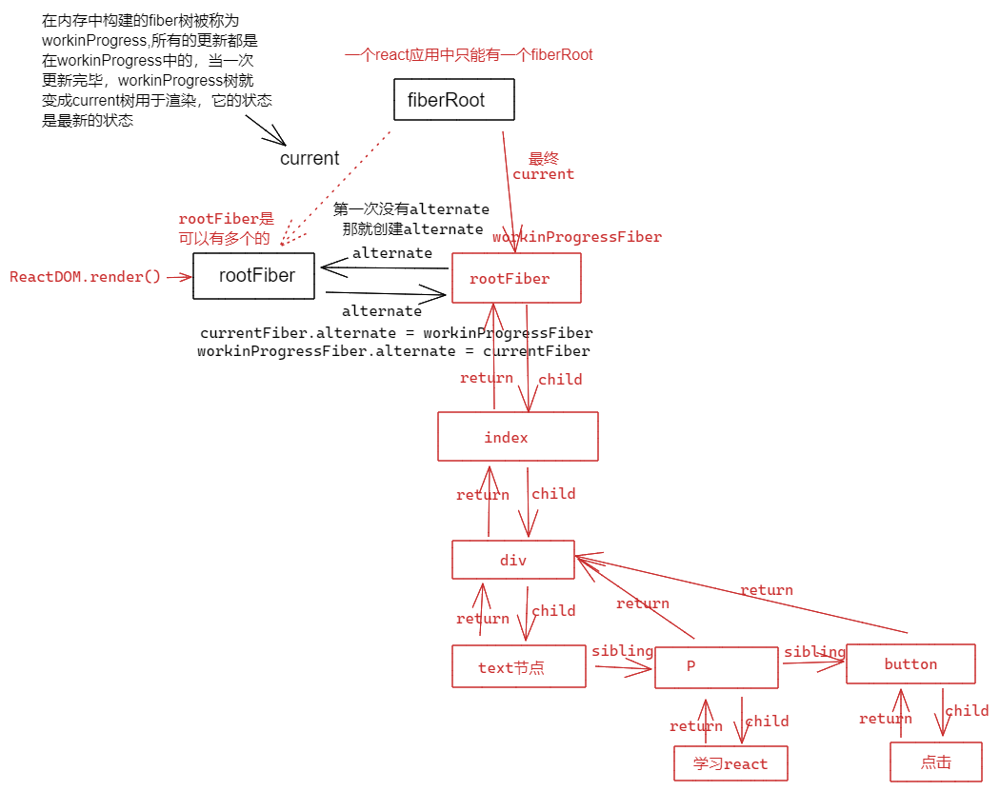

## fiber

### 什么是 fiber?

fiber 的目的是解决大型 react 应用的卡顿。 fiber 是在 react V16 版本出现的。fiber 在 React 中是最小粒度的执行单元，无论 React 还是 Vue ，在遍历更新每一个节点的时候都不是用的真实 DOM ，都是采用虚拟 DOM ，所以可以理解成 fiber 就是 React 的虚拟 DOM

### 为什么要用到 fiber?

在以前的版本，react 是采用递归的方式更新 react 的虚拟 DOM, 比如一次更新，就会从应用的根部递归跟新，递归一旦开始就无法停止,react 一直占用浏览器资源。 随着项目的越来越复杂。层级越来越多。就会导致更新的事件越来越长，就会出现卡顿的现象。

Reactv16 为了解决卡顿问题引入了 fiber ，为什么它能解决卡顿，更新 fiber 的过程叫做 Reconciler（调和器），每一个 fiber 都可以作为一个执行单元来处理，所以每一个 fiber 可以根据自身的过期时间 expirationTime（ v17 版本叫做优先级 lane ）来判断是否还有空间时间执行更新，如果没有时间更新，就要把主动权交给浏览器去渲染，做一些动画，重排（ reflow ），重绘 repaints 之类的事情，这样就能给用户感觉不是很卡。然后等浏览器空余时间，在通过 scheduler （调度器），再次恢复执行单元上来，这样就能本质上中断了渲染，提高了用户体验。

fiber 的实现中使用了`requestAnimationFrame`

```js
window.requestAnimationFrame(callback)希望浏览器在在下次重绘之前调用指定的回调函数callback更新动画。
window.requestIdleCallback()方法插入一个函数，这个函数将在浏览器空闲时期被调用。这使开发者能够在主事件循环上执行后台和低优先级工作，
而不会影响延迟关键事件，如动画和输入响应。函数一般会按先进先调用的顺序执行，然而，如果回调函数指定了执行超时时间timeout，则有可能为了在超时前执行函数而打乱执行顺序。


window.requestIdleCallback(callback)的callback中会接收到默认参数 deadline ，其中包含了以下两个属性：

- timeRamining 返回当前帧还剩多少时间供用户使用
- didTimeout 返回 callback 任务是否超时


```

### fiber、 真实 DOM、 element 的关系

- element； 我们写的 jsx 语法最终会被编译成一个 ReactElement 对象，其中包含 props 和 children 等信息。
- 真实 DOM: 元素在浏览器上给用户的只管体验
- fiber: 是 element 和真实 DOM 之间的交流枢纽，每一个类型的 element 都会对应一种 fiber 类型，element 的变化引起的更新都是在 fiber 层面做的一次调和，然后对于文件，形成新的 DOM 做视图渲染。

### fiber 里面保存了那些信息？

```js
function FiberNode() {
  this.tag = tag // fiber 标签 证明是什么类型fiber。
  this.key = key // key调和子节点时候用到。
  this.type = null // dom元素是对应的元素类型，比如div，组件指向组件对应的类或者函数。
  this.stateNode = null // 指向对应的真实dom元素，类组件指向组件实例，可以被ref获取。

  this.return = null // 指向父级fiber
  this.child = null // 指向子级fiber
  this.sibling = null // 指向兄弟fiber
  this.index = 0 // 索引

  this.ref = null // ref指向，ref函数，或者ref对象。

  this.pendingProps = pendingProps // 在一次更新中，代表element创建
  this.memoizedProps = null // 记录上一次更新完毕后的props
  this.updateQueue = null // 类组件存放setState更新队列，函数组件存放
  this.memoizedState = null // 类组件保存state信息，函数组件保存hooks信息，dom元素为null
  this.dependencies = null // context或是时间的依赖项

  this.mode = mode //描述fiber树的模式，比如 ConcurrentMode 模式

  this.effectTag = NoEffect // effect标签，用于收集effectList
  this.nextEffect = null // 指向下一个effect

  this.firstEffect = null // 第一个effect
  this.lastEffect = null // 最后一个effect

  this.expirationTime = NoWork // 通过不同过期时间，判断任务是否过期， 在v17版本用lane表示。

  this.alternate = null //双缓存树，指向缓存的fiber。更新阶段，两颗树互相交替。
}
```

### 每一个 fiber 是如何连接的

每一个 element 元素都对应一个 fiber,每一个 fiber 是通过 return、child 和 silbing 来连接的。

- return:指向父级的 siber
- child: 指向子 fiber 节点
- silbing:指向兄弟的 fiber 节点

### fiber 更新机制

### 初始化

#### 第一步 创建 fiberRoot 和 rootFiber

- fiberRoot: 首次构建应用，创建一个 fiberRoot，作为整个 react 的根基
- rootFiber: 通过 ReactDOM.render()渲染出来的，一个 react 中可以有多个 reactDOM.render()创建的 rootFiber，但是只能有一个 fiberRoot(应用根节点)。
  > ReactDOM.render(<Index/>, document.getELementById('root'))

在第一次的挂载中，会将 fiberRoot 和 rootFiber 建立连接

```js
function createFiberRoot(constainerInfo, tag) {
  const root = new FiberRootNode(constainer, tag)
  const rootFiber = createHostRootFiber(tag)
  root.current = rootFiber
  return root
}
```

#### 第二步 workiNProgress 树和 current 树

- workinProgress 是：正在内存中构建的 Fiber 被称为 workinProgress fiber 树， 在一次更新中，所有的更新都是发生 workinProgress 中，在一次跟新完成之后，workinProgress 树上的状态是最新的状态。那么它将变成 current 树由于渲染
- 正在视图层渲染的树叫做 current 树

接下来到 fiberRoot 的渲染流程，首先会复用当前 current 树的`alternate`作为 workinProgress,如果没有 alternate(初始化的 rootFiber 是没有 alternate 的)，那么创建一个 fiber 作为 workinProgress,会用 alternate 将新创建的 workinprogress 与 current 树建立关联，这个关联过程只有初始化创建 alternate 的时候进行。

```js
currentFiber.alternate = workInProgressFiber
workInProgressFiber.alternate = currentFiber
```

#### 第三步 深度调和子节点，渲染视图

按照第二步的实现，在型创建的 current 上，完成整个 fiber 树的遍历，包括 fiber 的创建

最后会以 workInProgress 作为最新的渲染树，fiberRoot 的 current 指针指向 workInProgress 使其变为 current Fiber 树。到此完成初始化流程。



### 更新

重新创建一颗 workInProgresss 树，复用当前 current 树上的 alternate ，作为新的 workInProgress ，由于初始化 rootfiber 有 alternate ，所以对于剩余的子节点，React 还需要创建一份，和 current 树上的 fiber 建立起 alternate 关联。渲染完毕后，workInProgresss 再次变成 current 树。

### 双缓冲树

canvas 绘制动画的时候，如果上一帧计算量比较大，导致清除上一帧画面到绘制当前帧画面之间有较长间隙，就会出现白屏。为了解决这个问题，canvas 在内存中绘制当前动画，绘制完毕后直接用当前帧替换上一帧画面，由于省去了两帧替换间的计算时间，不会出现从白屏到出现画面的闪烁情况。这种在内存中构建并直接替换的技术叫做双缓存。

React 用 workInProgress 树(内存中构建的树) 和 current (渲染树) 来实现更新逻辑。双缓存一个在内存中构建，一个渲染视图，两颗树用 alternate 指针相互指向，在下一次渲染的时候，直接复用缓存树做为下一次渲染树，上一次的渲染树又作为缓存树，这样可以防止只用一颗树更新状态的丢失的情况，又加快了 DOM 节点的替换与更新。

### render 和 commit 阶段

#### render 阶段

#### 1. beginWork

beginWork：是向下调和的过程。就是由 fiberRoot 按照 child 指针逐层向下调和，期间会执行函数组件，实例类组件，diff 调和子节点，打不同 effectTag。

#### 2. completeUnitOfWork

completeUnitOfWork：是向上归并的过程，如果有兄弟节点，会返回 sibling 兄弟，没有返回 return 父级，一直返回到 fiebrRoot ，期间可以形成 effectList 单向链表，在 commit 阶段，将不再需要遍历每一个 fiber ，只需要执行更新 effectList 就可以了。对于初始化流程会创建 DOM ，对于 DOM 元素进行事件收集，处理 style，className 等。

#### commit 阶段 ---------》 执行 effectList，更新 DOM，执行生命周期，获取 ref 等操作。

- Before mutation 阶段（执行 DOM 操作前）
  1. 因为 Before mutation 还没修改真实的 DOM ，是获取 DOM 快照的最佳时期，如果是类组件有 getSnapshotBeforeUpdate ，那么会执行这个生命周期。
  2. 会异步调用 useEffect ，在生命周期章节讲到 useEffect 是采用异步调用的模式，其目的就是防止同步执行时阻塞浏览器做视图渲染。
- mutation 阶段（执行 DOM 操作）
  1.  做 DOM 操作
  2.  置空 ref
- layout 阶段（执行 DOM 操作后）DOM 更新已经完成
  1. commitLayoutEffectOnFiber 对于类组件，会执行生命周期，setState 的 callback，对于函数组件会执行 useLayoutEffect 钩子。
  2. 如果有 ref ，会重新赋值 ref 。

总结： render 阶段: 1. 生成新的 fiber 节点，通过 diff 算法对比节点差异创建出用于更新操作的 workinprogressFiber 树，给需要更新的 fiber 打上相对应的 effectTag 并且生成用于更新的 effectList 链表。具体可以拆分为`beginWork`以及`completeWork`两个阶段,通过深度优先遍历的形式来进项这两个阶段。 2. 相比于 react15 的递归处理虚拟 dom 节点，Reconciler 通过链表的形式改成了循环处理。每处理完一个 fiber 节点都会检查时间是否充足或者是否又高优先级任务。 commit 阶段： 1. 当前阶段不会被打断，会根据上面两阶段生成的`effectList`一口气执行完成渲染操作。 2. 遍历 render 阶段生成的 effectList，effectList 上的 Fiber 节点保存着对应的 props 变化。之后会遍历 effectList 进行对应的 dom 操作和生命周期、hooks 回调或销毁函数。 3. 通过双缓存的技术 workInProgress Fiber 完成渲染后会变为 current Fiber 树
