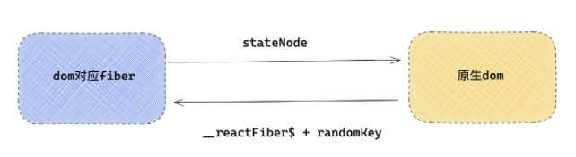
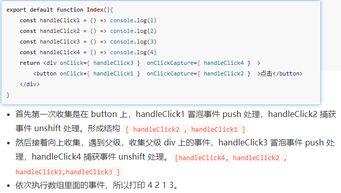

### react中的事件

在react中，我们要知道，
1. 给元素绑定的事件并不是真正的事件处理函数
2. 在冒泡/捕获阶段执行的事件也不会在冒泡/捕获阶段执行
3. 在事件处理函数中拿到的事件对象e也不是真正的事件源e


对于不同的浏览器，在事件方面存在差异，为了实现一个兼容全浏览器的框架，就有必要实现一套自己的时间系统


### 独特的事件处理

1. 事件捕获和事件冒泡阶段
- 在正常给react绑定的事件都是在事件冒泡阶段执行的
- 若是想要在事件捕获阶段执行就需要在事件后面加上capture， 如onClickCapture, onChangeCapture
2. react阻止事件冒泡可以用e.stopPropgation(),虽然写法是差不多的，但是底层的实现是不一样的

3. 阻止默认行为
- 原生事件：可以通过`e.preventDefault()`或者`return false`阻止默认事件。
- react中： `return false`是无法使用的。但是这个事件并非是原生的事件

### 事件合成

React事件系统分为三部分：
- 第一个部分是事件合成系统，初始化会注册不同的事件插件。
- 第二个就是在一次渲染过程中，对事件标签中事件的收集，向 container 注册事件。
- 第三个就是一次用户交互，事件触发，到事件执行一系列过程


时间合成的概念： react中，元素绑定的事件并不是原生的事件，而是react的合成事件，
react的事件并不是绑定在元素上的，v17之前是绑定在document上的，但是在v17之后就改成了绑到app容器上，这样更利于一个html下存在多个页面
绑定事件并不是一次绑定所有事件，而是发现一个事件之后才会绑定，发现另一个事件之后就会另外再绑定。

### 事件插件机制
对于不同的事件会有不同的插件
例如onClick对应的SimpleEventPlugin,  onChange对应的ChangeEventPlugin。

1. registrationNameModules: 记录了React事件和与之对应的处理插件的映射。 主要应用于事件触发阶段，根据不同的事件使用不同的插件
```js
const registrationNameModules = {
    onBlur: SimpleEventPlugin,
    onClick: SimpleEventPlugin,
    onClickCapture: SimpleEventPlugin,
    onChange: ChangeEventPlugin,
    onChangeCapture: ChangeEventPlugin,
    onMouseEnter: EnterLeaveEventPlugin,
    onMouseLeave: EnterLeaveEventPlugin,
    ...
}
```
2. registationNameDependencies: 这个对象保存的是React事件和原生事件的对应关系。
```js
在事件绑定阶段，如果发现有 React 事件，比如 onChange ，就会找到对应的原生事件数组，逐一绑定
{
    onBlur: ['blur'],
    onClick: ['click'],
    onClickCapture: ['click'],
    onChange: ['blur', 'change', 'click', 'focus', 'input', 'keydown', 'keyup', 'selectionchange'],
    onMouseEnter: ['mouseout', 'mouseover'],
    onMouseLeave: ['mouseout', 'mouseover'],
    ...
}
```

### 事件绑定


给元素绑定的事件最终会保存到元素对应fiber对象的memoizedProps属性上
React根据事件注册事件监听器
```js
// diffProperties 函数在 diff props 如果发现是合成事件( onClick ) 就会调用 legacyListenToEvent 函数。注册事件监听器
function diffProperties(){
    /* 判断当前的 propKey 是不是 React合成事件 */
    if(registrationNameModules.hasOwnProperty(propKey)){
         /* 这里多个函数简化了，如果是合成事件， 传入成事件名称 onClick ，向document注册事件  */
         legacyListenToEvent(registrationName, document）;
    }
}

// 注册事件
function legacyListenToEvent(registrationName，mountAt){
   const dependencies = registrationNameDependencies[registrationName]; // 根据 onClick 获取  onClick 依赖的事件数组 [ 'click' ]。
    for (let i = 0; i < dependencies.length; i++) {
    const dependency = dependencies[i];
    //  addEventListener 绑定事件监听器
    ...
  }
}

```

#### 绑定在 document 的事件处理函数是如上写的handleChange，handleClick 吗？
答案是否定的。 绑定在 document 的事件，是 React 统一的事件处理函数 dispatchEvent ，React 需要一个统一流程去代理事件逻辑，包括 React 批量更新等逻辑。

只要react事件触发，首先执行的就是dispatchEvent, 那么dispatchEvent是如何知道要绑定的是哪个事件嘛？，其实在注册的时候，就会通过bind,把参数绑定给
dispatchEvent了

### 事件触发

1. 批量更新
首先会执行dispatchEvent,dispatchEvent 执行会传入真实的事件源 button 元素本身.
可以通过元素找多元素对应的fiber，React 在初始化真实 DOM 的时候，用一个随机的 key internalInstanceKey 指针指向了当前 DOM 对应的 fiber 对象，fiber 对象用 stateNode 指向了当前的 DOM 元素

如何通过 dom 元素找到与之匹配的fiber？

接着就执行批量更新。。。
2. 合成事件源e，里面会包含preventDefault 和 stopPropgation方法
通过具体的事件找到事件对应的事件插件，合成新的事件源e
3. 形成事件执行队列
在第一步通过原生 DOM 获取到对应的 fiber ，接着会从这个 fiber 向上遍历，遇到元素类型 fiber ，就会收集事件，用一个数组收集事件：

如果遇到捕获阶段事件 onClickCapture ，就会 unshift 放在数组前面。以此模拟事件捕获阶段。
如果遇到冒泡阶段事件 onClick ，就会 push 到数组后面，模拟事件冒泡阶段。
一直收集到最顶端 app ，形成执行队列，在接下来阶段，依次执行队列里面的函数。
如以下的例子


#### React如何阻止事件冒泡
```js
function runEventsInBatch(){
    const dispatchListeners = event._dispatchListeners;
    if (Array.isArray(dispatchListeners)) {
    for (let i = 0; i < dispatchListeners.length; i++) {
      if (event.isPropagationStopped()) { /* 判断是否已经阻止事件冒泡 */
        break;
      }    
      dispatchListeners[i](event) /* 执行真正的处理函数 及handleClick1... */
    }
  }
}

对于上述队列 [handleClick4, handleClick2 , handleClick1, handleClick3 ]

假设在上述队列中，handleClick2 中调用 e.stopPropagation()，那么事件源里将有状态证明此次事件已经停止冒泡，
那么下次遍历的时候， event.isPropagationStopped() 就会返回 true ，所以跳出循环，handleClick1, handleClick3 将不再执行，模拟了阻止事件冒泡的过程。
```

