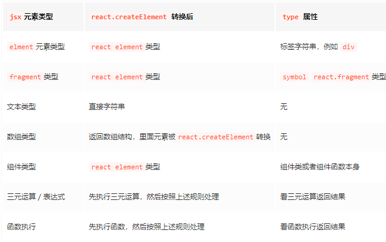

### JSX

JSX 是一个 javascript 的语法扩展，JSX 可以很好的描述 ui 应该呈现出它应有的交互的本质形式

React.Children 提供了用于处理 this.props.children 不透明数据结构的实用方法。


#### jsx 代码被 babel 处理之后会变成什么？

JSX 元素节点会被编译成 react 编译成 ReactElement 节点,
babel 会把 jsx 转译成一个 React.CreateElement()函数调用。

- React.createElement 使用方法：

```js
React.createElement(
  type, //如果是组件类型，会传入相应的类或者函数。若是dom元素类型就传入对应的dom元素
  [props], //一个对象，在 dom 类型中为标签属性，在组件类型中为 props
  [...chileren] // 依次为children,根据顺序排列。
);
```

比如：

```js
<div>
	<chengeComponent/>
	<h3>Hello React</h3>
	let us learn React!!
</div>
----------编译完之后---------
React.createElement('div', null,
	React.createElement(chengeElement, null),
	React.createElement('h3',null, 'Hello React')
	let us learn React!!
)
```

- JSX 转换规则
  
- 最终，在调和阶段，上述 React element 对象的每一个子节点都会形成一个与之对应的 fiber 对象，然后通过 sibling、return、child 将每一个 fiber 对象联系起来
