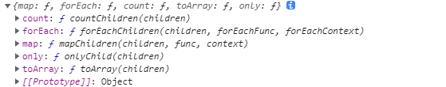

### JSX

React.Children 提供了用于处理 this.props.children 不透明数据结构的实用方法。



#### jsx 代码被 babel 处理之后会变成什么？

JSX 元素节点会被编译成 react 编译成 ReactElement 节点,

- React.createElement 使用方法：
```js
React.createElement(
	type, //如果是组件类型，会传入相应的类或者函数。若是dom元素类型就传入对应的dom元素
	[props], //一个对象，在 dom 类型中为标签属性，在组件类型中为 props 
	[...chileren]
)
```
比如：
```js
<div>
	<chengeComponent/>
	<h3>Hello React</h3>
	let us learn React!!
</div>
----------编译完之后---------
React.createElement('div', null,
	React.createElement(chengeElement, null),
	React.createElement('h3',null, 'Hello React')
	let us learn React!!
)
```
- JSX转换规则


